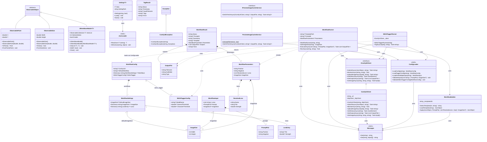

# クラス図

利用側（WPF GUI・将来の Discord ボット）から見た詳細図は各利用側リポジトリの `doc/class_diagram.md` を参照。
本図は ComfyUILibs 単体のクラス構成を示す。

```mermaid
classDiagram
    direction TB

    %% ----- Base -----

    class ObservableObject {
        <<abstract>>
    }

    class ObservablePoint {
        +double X
        +double Y
        +ObservablePoint()
        +ObservablePoint(double, double)
        +ToPoint() Point
        +FromPoint(Point) void
    }

    class ObservableSize {
        +double Width
        +double Height
        +ObservableSize()
        +ObservableSize(double, double)
        +ToSize() Size
        +FromSize(Size) void
    }

    %% ----- Ui -----

    class UIItemBaseModel~T~ {
        +ObservableCollection~T~ ItemList
        +int SelectedIndex
        +bool Enable
        +UIItemBaseModel()
        +UIItemBaseModel(UIItemBaseModel~T~)
        +Init(List~T~, T) void
        +Add(T, bool) void
        +Clear() void
    }

    %% ----- Common -----

    class JsonLoader {
        <<static>>
        +ReadJson~T~(string) T
        +WriteJson(string, object) void
    }

    class Setting~T~ {
        +T Data
        -string SettingPath
        +Setting(string, bool)
        +Load() void
        +Save() void
    }

    %% ----- Exceptions -----

    class ComfyUIException {
        +ComfyUIException(string)
        +ComfyUIException(string, Exception)
    }

    %% ----- Resources -----

    class Messages {
        <<static>>
        +Get(string) string
        +Get(string, object[]) string
    }

    %% ----- Models -----

    class ImageSize {
        +int Width
        +int Height
    }

    class LoraEntry {
        +string? File
        +double? Strength
    }

    class WorkflowSettings {
        +ImageSize? DefaultImageSize
        +Dictionary~string,ImageSize~? ImageSize
        +Dictionary~string,LoraEntry~? Loras
    }

    class Wd14TaggerConfig {
        +string? ModelName
        +double? GeneralThreshold
        +double? CharacterThreshold
    }

    class WorkflowConfig {
        +string? ComfyuiUrl
        +string? DefaultWorkflow
        +Dictionary~string,WorkflowSettings~? Workflows
        +Wd14TaggerConfig? Wd14Tagger
    }

    class PromptPair {
        +string Positive
        +string Negative
    }

    class WorkflowInput {
        +List~string~ Loras
        +PromptPair Prompts
        +ImageSize? ImageSize
    }

    class ResolvedLora {
        +string Name
        +string File
        +double Strength
    }

    class OutputFile {
        +string Filename
        +string Subfolder
        +string Type
    }

    class WorkflowParameters {
        +string Positive
        +string Negative
        +List~ResolvedLora~ Loras
        +ImageSize ImageSize
    }

    class WorkflowResult {
        +string Status
        +string? PromptId
        +string Timestamp
        +string? Template
        +WorkflowParameters Parameters
        +List~OutputFile~ Outputs
        +string? Error
    }

    class TagResult {
        +string Status
        +string Timestamp
        +string? InputFilename
        +string? Tags
        +string? Error
    }

    %% ----- Services -----

    class IComfyUIClient {
        <<interface>>
        +SubmitAsync(JsonObject, string) Task~string~
        +MonitorAsync(string, string) Task
        +UploadImageAsync(byte[], string) Task~string~
        +GetHistoryAsync(string) Task~JsonElement~
        +GetOutputsAsync(string) Task~List~OutputFile~~
        +GetImageAsync(string, string, string) Task~byte[]~
    }

    class ComfyUIClient {
        -string _url
        -HttpClient _httpClient
        +ComfyUIClient(string, HttpClient)
        +SubmitAsync(JsonObject, string) Task~string~
        +MonitorAsync(string, string) Task
        +UploadImageAsync(byte[], string) Task~string~
        +GetHistoryAsync(string) Task~JsonElement~
        +GetOutputsAsync(string) Task~List~OutputFile~~
        +GetImageAsync(string, string, string) Task~byte[]~
    }

    class WorkflowBuilder {
        -string _templatesDir
        +SelectTemplate(int, string) string
        +LoadTemplate(string) JsonObject
        +Apply(JsonObject, PromptPair, List~ResolvedLora~, long?, ImageSize?) JsonObject
    }

    class WorkflowRunner {
        +string? TemplatePath
        +string? PromptId
        +WorkflowParameters? Parameters
        +WorkflowRunner(string, string)
        +GetImageSize(string) ImageSize
        +ExecuteAsync(List~string~, PromptPair, ImageSize?) Task~List~OutputFile~~
        +RunAsync(string, string) Task
    }

    class ConfigLoader {
        <<static>>
        +LoadConfig(string) WorkflowConfig
        +LoadTaggerConfig(string) WorkflowConfig
        +LoadAndValidateInput(string) WorkflowInput
        +ValidateInputs(List~string~, PromptPair, ImageSize?) void
        +ValidateWd14TaggerConfig(WorkflowConfig) void
    }

    class Wd14TaggerRunner {
        -IComfyUIClient _client
        +Wd14TaggerRunner(string)
        +TagAsync(byte[], string) Task~string~
    }

    class IPreviewImageCacheService {
        <<interface>>
        +GetOrFetchAsync(IComfyUIClient, string?, OutputFile, string) Task~string?~
    }

    class PreviewImageCacheService {
        +IsImageFile(string) bool$
        +GetOrFetchAsync(IComfyUIClient, string?, OutputFile, string) Task~string?~
    }

    %% ----- 継承・実装 -----

    ObservableObject <|-- ObservablePoint
    ObservableObject <|-- ObservableSize
    ObservableObject <|-- UIItemBaseModel~T~
    Exception <|-- ComfyUIException
    IComfyUIClient <|.. ComfyUIClient
    IPreviewImageCacheService <|.. PreviewImageCacheService

    %% ----- 関連 -----

    Setting~T~ --> JsonLoader : uses

    WorkflowConfig "1" *-- "*" WorkflowSettings : workflows
    WorkflowConfig "1" o-- "0..1" Wd14TaggerConfig : wd14_tagger
    WorkflowSettings "1" o-- "0..1" ImageSize : defaultImageSize
    WorkflowSettings "1" o-- "*" LoraEntry : loras

    WorkflowInput "1" *-- "1" PromptPair : prompts
    WorkflowInput "1" o-- "0..1" ImageSize : imageSize

    WorkflowParameters "1" *-- "*" ResolvedLora : loras
    WorkflowParameters "1" *-- "1" ImageSize : imageSize

    WorkflowResult "1" *-- "1" WorkflowParameters : parameters
    WorkflowResult "1" *-- "*" OutputFile : outputs

    WorkflowRunner --> ConfigLoader : uses
    WorkflowRunner --> WorkflowBuilder : uses
    WorkflowRunner --> IComfyUIClient : uses
    WorkflowRunner ..> WorkflowConfig : loads via ConfigLoader
    WorkflowRunner ..> WorkflowParameters : creates
    WorkflowRunner ..> OutputFile : returns
    WorkflowRunner --> Messages : uses

    Wd14TaggerRunner --> IComfyUIClient : uses
    Wd14TaggerRunner --> ConfigLoader : uses
    Wd14TaggerRunner ..> Wd14TaggerConfig : uses
    Wd14TaggerRunner --> Messages : uses

    PreviewImageCacheService --> IComfyUIClient : uses
    PreviewImageCacheService ..> OutputFile : uses

    ComfyUIClient --> Messages : uses
    ConfigLoader --> Messages : uses
    WorkflowBuilder --> Messages : uses
```
